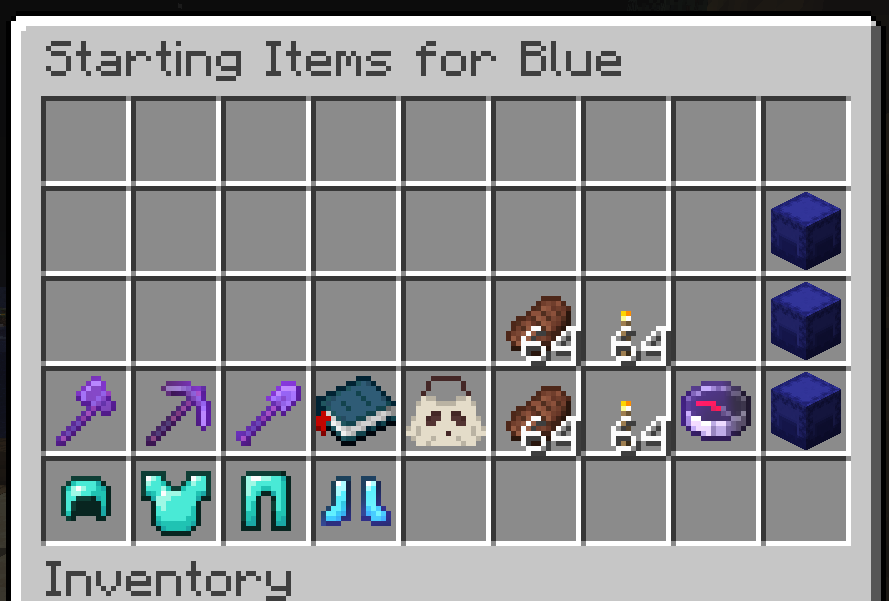
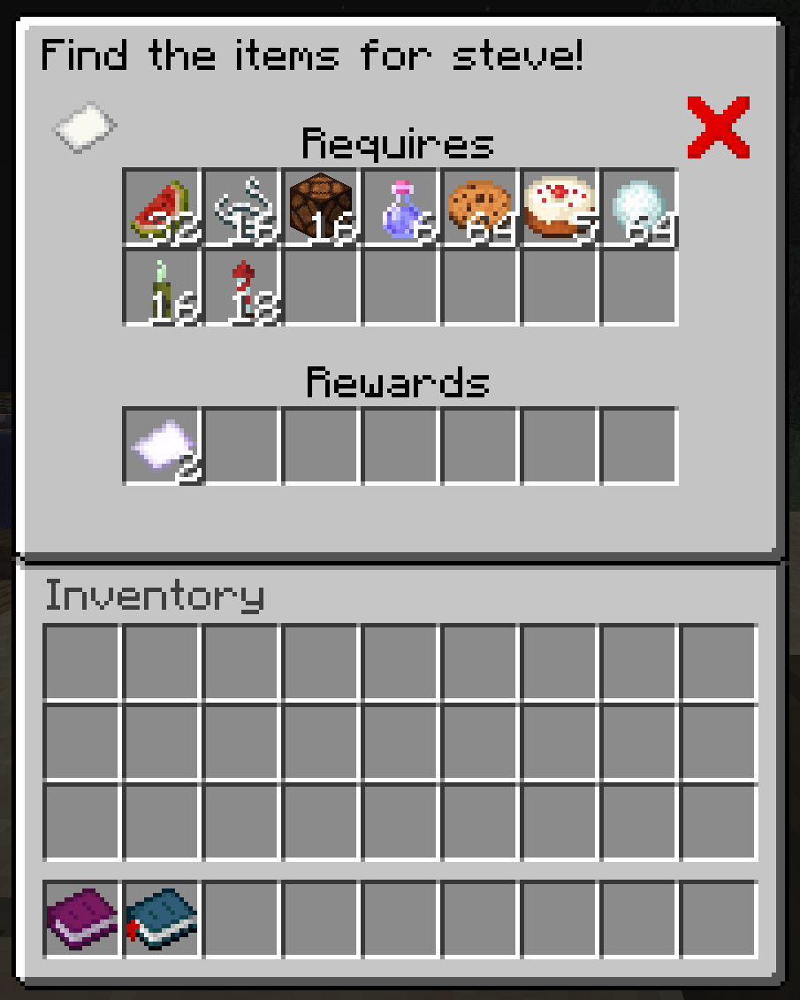
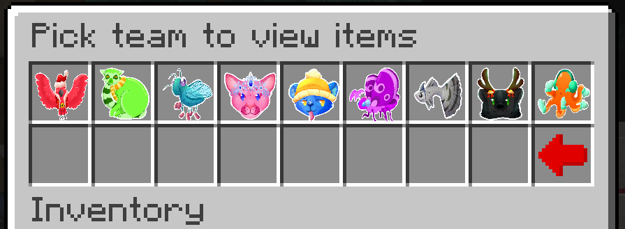

# GUI System

GUIs are designed to be flexible, while being simple to implement.
This is done with the [GUI class](page/Gui.java), which is the base of all GUI menus. 

Some implementations of this are [ListGui](page/ListGui.java) and [PresetGui](page/PresetGui.java).

Guis can also  be opened using a [GuiHeldItem](GuiHeldItem.java), which creates an item that can be right clicked
in-game to bring up, for that user, the gui of a specified [Openable](page/Openable.java).

## PresetGui

A PresetGui is a gui where the size is static, all of the elements in it are placed in specific slots. 
PresetGuis also have the option of using graphics, such as in this example:

## ListGui
A ListGui is a gui where the size can change, and the elements are placed in the gui in incrementing indexes.
They also can have an element in the last slot of the inventory, for navigating back to the last gui.

In this example, this [TeamGui](page/TeamGui.java), which is a subclass of ListGui, takes in a list of teams
and displays them in the gui with their icons
